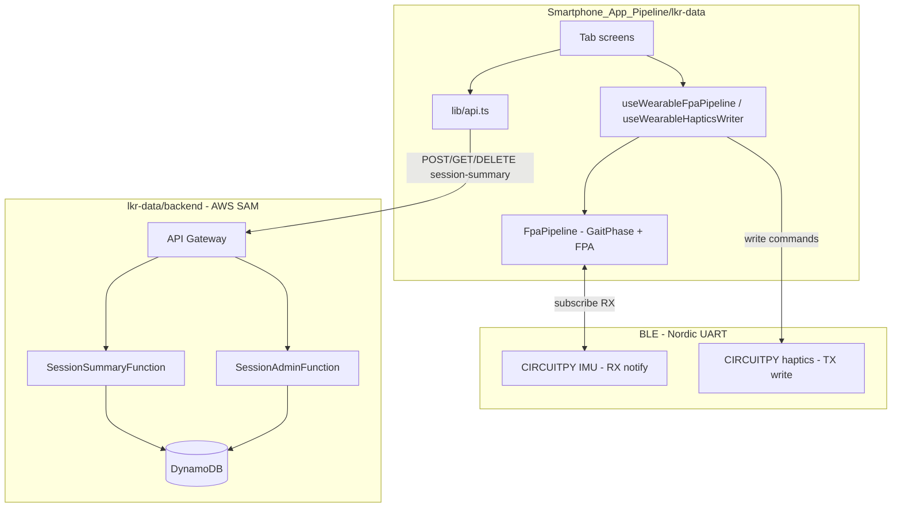

# LKR Data — App structure & documentation

**LKR Data** (`Smartphone_App_Pipeline/lkr-data`) is an [Expo](https://expo.dev) + [Expo Router](https://docs.expo.dev/router/introduction/) React Native app for the wearable haptics research platform. It connects to two BLE peripherals (IMU + haptics), runs **foot progression angle (FPA)** and gait-phase algorithms **on the phone**, drives real-time haptic feedback, logs CSV, and optionally syncs finished sessions to AWS for the History tab.

**Run / deploy:** [app-deploy.md](app-deploy.md)

---

## Repository context

This app is one component of **Wearable-Haptics-Device**:

```
Wearable-Haptics-Device/
├── Wearable/                         # CircuitPython on foot + shank MCUs
├── Laptop_Pipeline/                  # Python BLE pipeline + config.json
├── Smartphone_App_Pipeline/
│   └── lkr-data/                     # ← this document
└── Data_Processing/                  # offline FPA / mocap analysis
```

| Component | Data path |
|-----------|-----------|
| **Wearable** foot MCU | IMU → BLE Nordic UART RX |
| **This app** (or **Laptop_Pipeline**) | Subscribe RX → FPA per step → compare to baseline |
| **Wearable** shank MCU | BLE UART TX → parse driver id → LRA on mux channel 1 or 2 |
| **backend/** (optional) | POST session CSV summary → DynamoDB |

---

## High-level architecture



| Layer | Role |
|--------|------|
| **`app/`** | File-based routes, tab navigation, screen UI |
| **`hooks/`** | BLE subscription, haptics writes, layout helpers |
| **`lib/wearable/`** | Port of laptop `sage_motion` IMU/FPA/gait logic + Nordic UART helpers |
| **`lib/api.ts`** | HTTP client for session summaries (`EXPO_PUBLIC_API_BASE_URL`) |
| **`backend/`** | AWS SAM: persist/list/delete session aggregates |
| **`components/`**, **`constants/`** | Shared UI and theming |

**Processing split:** Real-time FPA and feedback run **on-device**. The backend **does not** expose live `/process`; it only stores **session summaries** after a walk ends (see `processBlePacket` in `lib/api.ts`, which throws if called).

**Laptop parity:** Logic aligns with [Laptop_Pipeline/run_device.py](../../Laptop_Pipeline/run_device.py) and [Laptop_Pipeline/algorithms/sage_motion/](../../Laptop_Pipeline/algorithms/sage_motion/). Laptop settings live in `Laptop_Pipeline/config.json`; the app still uses constants in screen files (see Active Session below).

---

## Project layout (`Smartphone_App_Pipeline/lkr-data/`)

```
Smartphone_App_Pipeline/lkr-data/
├── app/                    # Expo Router screens
│   ├── _layout.tsx         # Root stack (tabs + modal)
│   ├── modal.tsx           # Example modal route
│   └── (tabs)/
│       ├── _layout.tsx     # Bottom tab navigator
│       ├── index.tsx       # Redirect → active-session
│       ├── active-session.tsx   # Primary user flow (tab visible)
│       ├── history.tsx            # Tab visible
│       ├── insights.tsx           # Tab visible
│       ├── explore.tsx            # Hidden (Expo template)
│       ├── fpa.tsx                # Hidden (dev / lab BLE screen)
│       └── backend.tsx            # Hidden (legacy cloud BLE path)
├── hooks/
├── lib/
│   ├── api.ts
│   └── wearable/           # DSP, gait, FPA, BLE
├── components/
├── constants/
├── assets/
├── backend/                # AWS SAM (Python Lambdas)
├── app.json
├── package.json
├── app-overview.md         # This file
└── app-deploy.md           # Run & deploy instructions
```

Path alias: `@/*` → project root (`tsconfig.json`).

---

## Navigation & routing

### Root layout (`app/_layout.tsx`)

- Wraps the app in React Navigation `ThemeProvider` (light/dark from `useColorScheme`).
- **Stack** with:
  - `(tabs)` — main experience, no header
  - `modal` — presented as a modal (`app/modal.tsx`)
- `unstable_settings.anchor = '(tabs)'` keeps deep links anchored to the tab group.

### Tab layout (`app/(tabs)/_layout.tsx`)

| Route file | Tab bar | `initialRouteName` |
|------------|---------|-------------------|
| `active-session` | **Visible** — “Active Session” | **Default tab** |
| `history` | **Visible** — “History” | |
| `insights` | **Visible** — “Insights” | |
| `index` | Hidden (`href: null`) | Redirect only |
| `explore` | Hidden (`href: null`) | Expo starter content |
| `fpa` | Hidden (`href: null`) | Developer BLE/FPA UI |
| `backend` | Hidden (`href: null`) | Legacy Lambda BLE pipeline |

Tab buttons use `HapticTab` for light haptic feedback on press. Icons use SF Symbols via `IconSymbol`.

### Entry redirect (`app/(tabs)/index.tsx`)

Immediately redirects to `/(tabs)/active-session` so the app opens on the live session screen.

### Modal (`app/modal.tsx`)

Template modal with a link back to `/`. Not wired into the main haptics workflow today.

**Opening hidden screens:** Navigate programmatically, e.g. `router.push('/(tabs)/fpa')`, or temporarily remove `href: null` in `_layout.tsx`.

---

## App pages (detailed)

### Active Session — `app/(tabs)/active-session.tsx`

**Purpose:** End-to-end user session: connect wearables, calibrate baseline FPA, monitor live metrics, auto haptic feedback, export CSV, upload summary on disconnect.

**BLE flow:**

1. On mount (iOS/Android only), creates `BleManager`, auto-scans 5s for devices named `CIRCUITPY*`.
2. `connectNordicDevices` connects to all matches; `assignReceiverAndSenderDevices` assigns:
   - **Receiver (IMU):** `CIRCUITPY4F33` if present, else lexicographically first device — FPA pipeline subscribes to Nordic UART **RX**.
   - **Sender (haptics):** `CIRCUITPY174d` if present, else second device — commands via UART **TX**.
3. Requires **both** devices for auto-feedback (dual-device setup).

**Hooks:**

- `useWearableFpaPipeline({ datarate: 180, isRightFoot: true })` — per-step FPA from IMU notifications.
- `useWearableHapticsWriter()` — writes feedback strings to the haptics device.

**Calibration:**

- 60s walk; first 7 steps ignored; averages per-step FPA → `setStoredBaseFpaDeg` (AsyncStorage).
- Can trigger connect-first if not yet connected.

**Auto feedback (thresholds in this screen):**

| Condition (`diff = fpa − base`) | BLE command (app) | Shank firmware |
|----------------------------------|-------------------|----------------|
| `diff < -9°` | `"212"` (driver 2 + legacy effect digit) | Uses first char → driver **2** |
| `diff > -1°` | `"112"` (driver 1 + legacy effect digit) | Uses first char → driver **1** |
| else | (none) | — |

Laptop pipeline sends `"1"` / `"2"` only ([Laptop_Pipeline/config.json](../../Laptop_Pipeline/config.json)); firmware parses `int(received_str[0])` in [Wearable/shank_mounted_wearable.py](../../Wearable/shank_mounted_wearable.py).

**Session UI:**

- KPI card: current FPA, session timer, step count, rate, base FPA, feedback window, direction label.
- `MiniBarChart` of FPA over the session (target line from calibrated base).
- Controls: Start / Rescan / Calibrate / Disconnect / Export CSV.

**Data logging:**

- Each new per-step FPA appends a CSV row (IMU + metadata). Export via `expo-file-system` + `Share`.

**Backend on disconnect:**

- Stops BLE, then `createSessionSummary` with session id `session-{startedAtMs}` and full CSV.
- Requires `EXPO_PUBLIC_API_BASE_URL`; status shown in UI (`backendStatus`).

---

### History — `app/(tabs)/history.tsx`

**Purpose:** Read persisted walking sessions from AWS and visualize trends.

**API:** `listSessionSummaries()` on load and Refresh; `deleteSessionSummary(session_id)` per card.

**UI:**

- KPIs: all-time average FPA, session count.
- `MiniAreaBars`: average FPA per session (oldest → newest).
- Cards: start time, duration, avg/min/max FPA, variability, step count, Delete.

**Dependencies:** Deployed SAM stack under `backend/` + `EXPO_PUBLIC_API_BASE_URL`. See [app-deploy.md](app-deploy.md).

---

### Insights — `app/(tabs)/insights.tsx`

**Purpose:** Habit-building and coaching UI (mostly **placeholder / mock data** today).

**Static demo metrics:** 30-day avg FPA, variability, sessions/week, adherence %.

**Interactive:**

- Toggleable “habits” with streaks; computed **habit score** (0–100).
- Rule-based **recommendations** from the static stats.

Not yet wired to BLE or `lib/api.ts`.

---

### FPA (hidden) — `app/(tabs)/fpa.tsx`

**Purpose:** Developer / lab screen for the same on-device BLE + FPA stack as Active Session, with **stricter feedback thresholds** and disconnect without AWS upload.

| Aspect | Active Session | FPA tab |
|--------|----------------|---------|
| Feedback thresholds | −9° / −1° | −12° / −8° |
| Session timer / KPI polish | Full session UX | Stream-focused |
| Disconnect | Saves to DynamoDB | Local disconnect only |
| Tab visibility | Main tab | `href: null` |

Same hooks, dual-device requirement, calibration, CSV export, and auto-scan on mount.

---

### Backend (hidden) — `app/(tabs)/backend.tsx`

**Purpose:** **Legacy** path that streamed raw BLE packets to Lambda for server-side FPA. The `/process` endpoint was removed; `processBlePacket` in `lib/api.ts` now throws. **Use Active Session or FPA for processing.**

---

### Explore (hidden) — `app/(tabs)/explore.tsx`

Expo template page; not part of the product flow.

---

## Shared libraries

### `lib/wearable/` — on-device algorithm stack

Exported from `lib/wearable/index.ts`. Mirrors [Laptop_Pipeline/algorithms/sage_motion/](../../Laptop_Pipeline/algorithms/sage_motion/).

| Module | Responsibility |
|--------|----------------|
| `const.ts` | Shared numeric constants |
| `sensorTypes.ts` | `SensorData` (accel m/s², gyro deg/s) |
| `imuPayload.ts` | Base64 BLE payload → `SensorData` |
| `euler2mat.ts` | Orientation math |
| `dspSignal.ts` | Filtering / signal helpers |
| `gaitPhase.ts` | Gait phase state machine, step count, feedback window |
| `fpaAlgorithm.ts` | Per-step FPA computation |
| `fpaPipeline.ts` | `FpaPipeline` class: wires gait + FPA, rate estimate, `fpaUpdated` events |
| `nordicUart.ts` | Scan/connect, RX monitor, TX write |
| `nordicRoles.ts` | IMU vs haptics device assignment |
| `fpaRunCounter.ts` | AsyncStorage: global run counter + calibrated base FPA |

**`FpaPipeline` output** (`FpaPipelineOutput`): latest sensor sample, `rateHz`, `inFeedbackWindow`, `fpaUpdated`, `fpaUpdateCount`, `stepCount`, `fpaThisStepDeg`, `globalRunNumber`.

### `lib/api.ts` — HTTP

| Function | Endpoint | Status |
|----------|----------|--------|
| `createSessionSummary` | `POST /session-summary` | Active |
| `listSessionSummaries` | `GET /session-summaries` | Active |
| `deleteSessionSummary` | `DELETE /session-summary` | Active |
| `processBlePacket` | (removed) | Throws — use on-device pipeline |

Base URL: `process.env.EXPO_PUBLIC_API_BASE_URL` (no trailing slash).

### Hooks

| Hook | Role |
|------|------|
| `use-wearable-fpa-pipeline.ts` | Subscribes to Nordic RX; runs `FpaPipeline` per notification |
| `use-wearable-haptics-writer.ts` | Writes command strings to configured sender device |
| `use-color-scheme.ts` | Light/dark (platform-specific `.web` variant) |
| `use-iphone13-content-frame.ts` | Centers content at 390pt width, safe area + tab bar padding |
| `use-theme-color.ts` | Themed color helper for components |

### npm dependencies (unchanged stack)

Key packages in `package.json`: **Expo 54**, **expo-router**, **react-native-ble-plx**, **base-64**, **@react-native-async-storage/async-storage**, **expo-file-system**. Full list: `package.json`.

---

## AWS backend (`backend/`)

SAM template deploys:

- **`POST /session-summary`** — parse uploaded CSV, compute stats; write DynamoDB item.
- **`GET /session-summaries`** — list for History tab.
- **`DELETE /session-summary`** — delete by id(s); return aggregate stats.

Deploy from `Smartphone_App_Pipeline/lkr-data/backend` — see [backend/README.md](backend/README.md) and [app-deploy.md](app-deploy.md).

---

## BLE protocol summary

- **Service:** Nordic UART `6e400001-b5a3-f393-e0a9-e50e24dcca9e`
- **RX (notify):** `6e400003-...` — IMU stream into `FpaPipeline`
- **TX (write):** `6e400002-...` — haptic commands (ASCII; firmware uses first character as driver id)
- **Device names:** prefix `CIRCUITPY`; known pair `CIRCUITPY4F33` (IMU), `CIRCUITPY174d` (haptics)

`app.json` declares Bluetooth usage strings for iOS. BLE requires a **physical** iOS or Android device.

---

## Running the app

```bash
cd Smartphone_App_Pipeline/lkr-data
npm install
npx expo start
```

- **Development build** recommended for `react-native-ble-plx` — see [app-deploy.md](app-deploy.md).
- **EAS:** `eas.json` for Expo Application Services builds.

Scripts: `npm run ios` / `android` / `web` / `lint`.

---

## Typical user journey

1. Open app → **Active Session** (auto-scan/connect).
2. **Calibrate** 60s to set personal base FPA.
3. Walk with live FPA chart and automatic haptics when deviation exceeds thresholds.
4. **Export CSV** optionally during/after session.
5. **Disconnect** → session summary uploaded to AWS (if configured).
6. **History** → review/delete past sessions.
7. **Insights** → habits/recommendations (mock data today).

---

## Related code outside this folder

| Location | Relationship |
|----------|----------------|
| [Laptop_Pipeline/run_device.py](../../Laptop_Pipeline/run_device.py) | Laptop BLE loop + `config.json` thresholds |
| [Laptop_Pipeline/bluetooth.py](../../Laptop_Pipeline/bluetooth.py) | Nordic UART discovery (Python) |
| [Wearable/foot_mounted_wearable.py](../../Wearable/foot_mounted_wearable.py) | IMU BLE stream |
| [Wearable/shank_mounted_wearable.py](../../Wearable/shank_mounted_wearable.py) | Haptic command parsing |
| [README.md](../../README.md) | Whole-repo overview |

---

## File quick reference

| Path | One-line description |
|------|----------------------|
| `app/(tabs)/active-session.tsx` | Production session + AWS save |
| `app/(tabs)/history.tsx` | DynamoDB session list |
| `app/(tabs)/insights.tsx` | Habits / coaching (mock) |
| `app/(tabs)/fpa.tsx` | Lab BLE/FPA (hidden) |
| `app/(tabs)/backend.tsx` | Deprecated cloud processor (hidden) |
| `hooks/use-wearable-fpa-pipeline.ts` | BLE → FPA hook |
| `hooks/use-wearable-haptics-writer.ts` | BLE haptics hook |
| `lib/wearable/fpaPipeline.ts` | Core processing class |
| `lib/api.ts` | Session summary REST client |
| `backend/template.yaml` | API Gateway + Lambda + DynamoDB |
